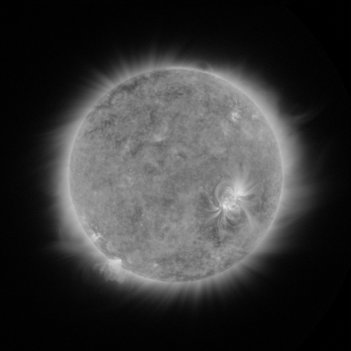
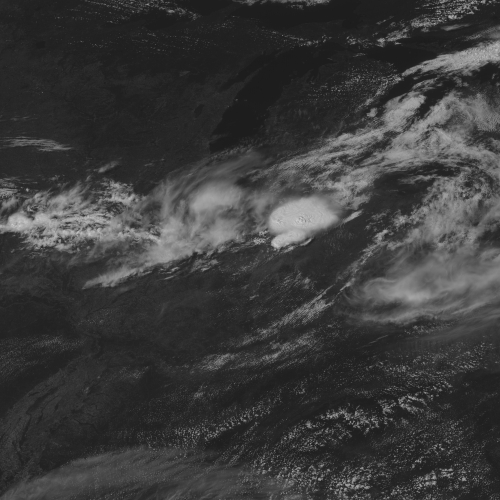
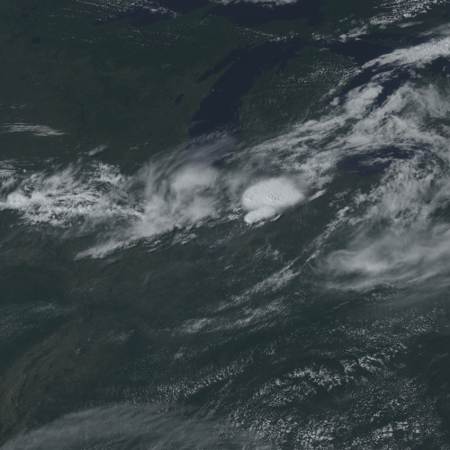
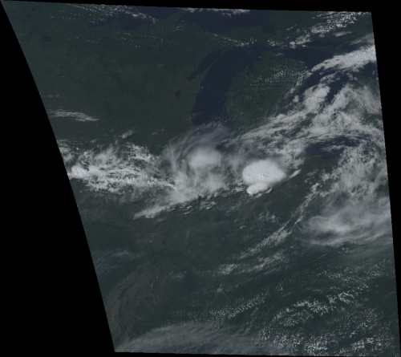
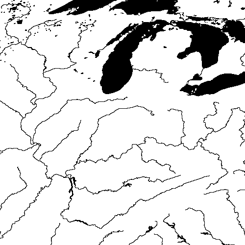
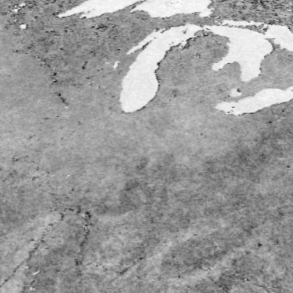

# heregoes

<p>
<a href="https://github.com/heregoesradio/heregoes/blob/main/LICENSE.txt"></a>
<a href="https://github.com/psf/black"></a>
</p>

This is the core processing library used by [Here GOES Radiotelescope (2020)](https://heregoesradio.com/), a sculptural ground station for the GRB downlink of the NOAA weather satellite GOES-16. The library renders basic ABI and SUVI imagery from netCDF, and offers some useful functions for navigating and projecting ABI data. Some additional convenience functions for working with 2D NumPy arrays are provided in [util.py](heregoes/util.py). To optimize for the real-time processing needs of Here GOES Radiotelescope, array functions are accelerated using [Numba](https://numba.pydata.org/) with parallelism controlled by environmental variables.

<p float="left">
    <a href="https://static.heregoesradio.com/abi/fulldisk/2019-09-04/grb_g16_fulldisk_color_2019-09-04T170015Z.jpg">
        
    </a>
    <a href="http://static.heregoesradio.com/abi/fulldisk/2019-09-04/grb_g16_fulldisk_color_2019-09-04T170015Z_cog.jpg">
        
    </a>
</p>

---

## Setup

Clone this repository and install the Conda environment:
```
conda env create -f heregoes-env.yml
conda activate heregoes-env
```

Optional environmental variables:
- `HEREGOES_ENV_PARALLEL`: Defaults to `False`
- `HEREGOES_ENV_NUM_CPUS`: Number of CPUs to use if `HEREGOES_ENV_PARALLEL` is `True`. Defaults to the number of CPUs reported by the OS
- `HEREGOES_ENV_IREMIS_DIR`: Directory path of the UW CIMSS IREMIS dataset which can be downloaded [here](https://cimss.ssec.wisc.edu/iremis/)

---

## Imagery Examples

### Render a single-channel SUVI image

With a 1-second exposure SUVI netCDF file `suvi_nc`:

```python
from heregoes import image

suvi_image = image.SUVIImage(suvi_nc)
suvi_image.save('suvi.jpg')
```


### Render a single-channel ABI image

With an ABI L1b radiance netCDF file `abi_nc`, render the L2 CMI product:

```python
from heregoes import image

abi_image = image.ABIImage(abi_nc, gamma=0.75)
abi_image.save('abi.jpg')
```


### Render the ABI 'natural' color RGB

With ABI L1b radiance files for the 0.64 μm (`red_nc`), 0.86 μm (`green_nc`), and 0.47 μm (`blue_nc`) components:

```python
from heregoes import image

abi_rgb = image.ABINaturalRGB(red_nc, green_nc, blue_nc, gamma=0.75)
abi_rgb.save('rgb.jpg')
```


### Create a Cloud-Optimized GeoTIFF from an ABI RGB

With the `abi_rgb` object from the previous step:

```python
from heregoes import projection

abi_projection = projection.ABIProjection(abi_rgb.meta)
abi_projection.resample2cog(abi_rgb.bv, 'rgb.tiff')
```


---

## Navigation Examples

### Navigate an ABI image to latitude and longitude

With an ABI L1b radiance netCDF file `abi_nc`:

```python
from heregoes import meta, navigation

abi_meta = meta.NCMeta(abi_nc)
abi_navigation = navigation.ABINavigation(abi_meta)
abi_navigation.lat_deg #latitude array
abi_navigation.lon_deg #longitude array
```

### Calculate the per-pixel spatial coverage of an ABI image

With the `abi_navigation` object from the previous step:

```python
abi_navigation.area_m #area of each pixel in square meters
```

### Calculate per-pixel Sun and satellite vector angles of an ABI image

With the `abi_navigation` object from the previous step:

```python
abi_navigation.sun_za #solar zenith angle
abi_navigation.sun_az #solar azimuth in North-clockwise convention

abi_navigation.sat_za #satellite zenith angle
abi_navigation.sat_az #satellite azimuth in North-clockwise convention
```

### Find a pixel in an ABI image from latitude and longitude

With an ABI L1b radiance netCDF file `abi_nc`:

```python
from heregoes import meta, navigation

abi_meta = meta.NCMeta(abi_nc)
abi_navigation = navigation.ABINavigation(abi_meta, lat_deg=44.72609499, lon_deg=-93.02279070)
abi_navigation.index #index of the ABI image at provided latitude and longitude
```

---

## Ancillary Dataset Examples

### Create a GSHHS/Natural Earth boolean water mask projected to an ABI image

With an ABI L1b radiance netCDF file `abi_nc`:

```python
import cv2
from heregoes import ancillary, meta

abi_meta = meta.NCMeta(abi_nc)
water = ancillary.WaterMask(abi_meta, rivers=True)
cv2.imwrite('water.jpg', water.data['water_mask'] * 255)
```


### Load IREMIS land emissivity and project it for an ABI channel 7 image

With an ABI L1b radiance netCDF file for 3.9 μm `c07_nc`:

```python
import cv2
from heregoes import ancillary, meta, util

c07_meta = meta.NCMeta(c07_nc)
iremis = ancillary.IREMIS(c07_meta)
cv2.imwrite('iremis.jpg', util.minmax(iremis.data['c07_land_emissivity']) * 255)
```
