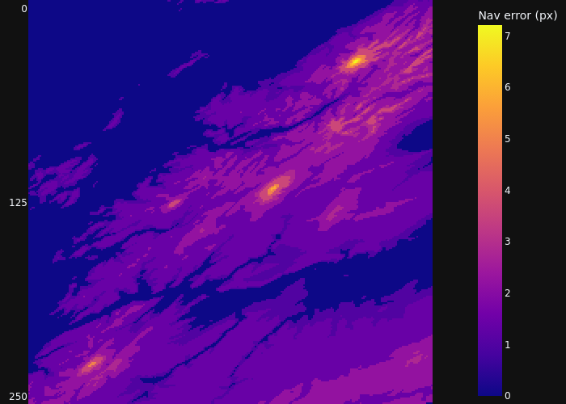
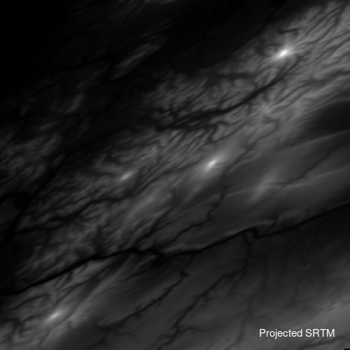
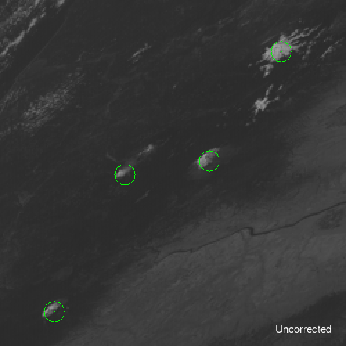

## Terrain correction of the ABI Fixed Grid using heregoes

Here we parallax-correct ABI imagery and geolocation in its native Fixed Grid projection using the `heregoes` library (`netCDF4`, `Numpy`, `GDAL`, `cv2`). See the [navigation README](../heregoes/navigation/README.md) for more background on navigation and parallax correction with `heregoes`.

### Motivation
At off-nadir viewing angles, the apparent positions of Earth features like cloud or high terrain are displaced by parallax effects in satellite imagery (Figure 1). Cloud height can be estimated from radiance and used to derive the true geodetic coordinates of cloud pixels[^1]. Orthorectification is the inverse problem, where terrain height and coordinates are known, but the pixel locations are not[^2].

* **Figure 1.** *Geolocation error from terrain parallax in a 500 m resolution GOES-East ABI image (250x250 px).*

 

In 2022, Pestana and Lundquist[^3] demonstrated that rapid orthorectification of ABI imagery can be achieved in Python by interpolating ABI pixels onto a digital elevation model (DEM). However, as the authors note, ABI L1b radiance is already resampled from detector counts through ground system processing[^4]. Further resampling by orthorectification complicates sub-pixel retrievals, particularly for high-intensity targets such as fires[^5]. With the `heregoes` library, we can accurately navigate elevated pixels *in situ* and preserve the original sampling of the L1b image.

### Method
SRTM ellipsoidal heights are projected to a subset of the ABI scene for a region of interest. The parallax displacement vector can then be recovered in cartesian space with fast Numpy indexing methods. We apply the inverse vector to translate Fixed Grid coordinates away from nadir to their observed positions in L1b pixels (Figure 2, Figure 3). In `heregoes`, the image layer is colocated with navigation and either can be translated individually to achieve backward or forward (Figure 4) orthorectification. See [`ABINavigation`](../heregoes/navigation/_navigation.py) and demo code in [orthorectification.py](orthorectification.py).

* **Figure 2.** *Inverse orthorectification illustrated by applying to the projected SRTM elevation data instead of ABI Fixed Grid coordinates.*

 

### Demo
We consider a region of the GOES-East CONUS covering the Pacific Northwest. Summit locations of four mountains in the Cascade Range are targeted to track displacement by parallax: Mt. Rainier, Mt. St. Helens, Mt. Adams, and Mt. Hood.

* **Figure 3.** *Mountaintop coordinates (circled in green) are navigated in the ABI image. When the navigation is inverse orthorectified, the coordinates align with the displaced summit pixels in the original image.*

 

If `resample_nav=False` is passed to `heregoes.image.ABIImage()`, the image pixels are translated instead of the navigation (Figure 4). This is the default behavior as of v1.0.0:

* **Figure 4.** *Mountaintop coordinates (circled in green) are navigated in the GOES-East ABI image. After orthorectification of the image, the summit pixels align with the displaced coordinates.*

 

### References
[^1]: https://www.star.nesdis.noaa.gov/goesr/documents/ATBDs/Baseline/ATBD_GOES-R_Cloud_Height_v3.0_Jul2012.pdf
[^2]: https://doi.org/10.3390/rs15092403
[^3]: https://doi.org/10.1016/j.rse.2022.113221
[^4]: https://doi.org/10.3390/rs10020177
[^5]: https://doi.org/10.1016/B978-0-12-814327-8.00013-5